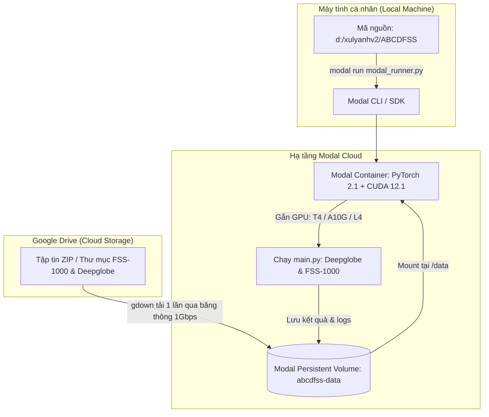

# KẾ HOẠCH CHI TIẾT: CHẠY THỬ NGHIỆM ABCDFSS TRÊN GPU MODAL VỚI DỮ LIỆU GOOGLE DRIVE
## Hướng Dẫn Từng Bước (A-Z) Cho Kỹ Sư Nghiên Cứu

---

### TỔNG QUAN KIẾN TRÚC TRIỂN KHAI

[Modal (modal.com)](https://modal.com) là nền tảng Serverless Cloud GPU hàng đầu hiện nay, cho phép chạy các tác vụ PyTorch trực tiếp từ code Python nội bộ mà không cần tự cấu hình máy ảo (VM), cài driver NVIDIA hay thuê server cố định. Bạn chỉ trả tiền chính xác theo từng giây GPU hoạt động.



---

## BƯỚC 1: CHUẨN BỊ TÀI KHOẢN & MÔI TRƯỜNG MODAL TẠI LOCAL

### 1.1. Đăng ký tài khoản Modal
1. Truy cập [https://modal.com](https://modal.com) và đăng ký tài khoản (miễn phí $30 credits hàng tháng - đủ để chạy hàng trăm bài test).
2. Kiểm tra giao diện Dashboard để xác nhận tài khoản hoạt động.

### 1.2. Cài đặt Modal SDK trên máy tính (PowerShell)
Mở terminal PowerShell tại máy tính của bạn và chạy:

```powershell
pip install modal gdown
```

### 1.3. Xác thực tài khoản (Authentication)
Chạy lệnh sau:
```powershell
modal setup
```
- Trình duyệt sẽ tự động mở trang cấp quyền của Modal.
- Bấm **Authorize Token**. Terminal sẽ báo `Token written to ...` thành công.

---

## BƯỚC 2: CHUẨN BỊ DỮ LIỆU TỪ GOOGLE DRIVE SANG MODAL

Có **2 phương án** để đưa dữ liệu từ Google Drive lên Modal Volume. Khuyên dùng **Phương án A (Tải trực tiếp qua Modal Cloud)** vì tốc độ mạng cloud của Modal đạt $>100 \text{ MB/s}$.

### 2.1. Chuẩn bị Link trên Google Drive
Để Modal có thể tải dữ liệu tự động, bạn cần lấy **File ID** hoặc **Folder ID** từ Google Drive:
1. Chuột phải vào file zip (ví dụ `deepglobe.zip` hoặc `fss1000.zip`) trên Google Drive $\rightarrow$ chọn **Chia sẻ (Share)** $\rightarrow$ Đổi quyền truy cập thành **Bất kỳ ai có đường liên kết đều có thể xem (Anyone with the link can view)**.
2. Sao chép liên kết. Liên kết có dạng:
   - File: `https://drive.google.com/file/d/1a2b3c4d5e6f7g8h9/view?usp=sharing` $\rightarrow$ ID là: `1a2b3c4d5e6f7g8h9`
   - Folder: `https://drive.google.com/drive/folders/1XYZ987654321` $\rightarrow$ ID là: `1XYZ987654321`

---

## BƯỚC 3: CẤU TRÚC THƯ MỤC CHUẨN CỦA DỮ LIỆU TRÊN MODAL

Để `data/deepglobe.py` và `data/fss.py` đọc đúng dữ liệu, cấu trúc thư mục trên Modal Volume (`/data`) phải chính xác như sau:

```text
/data/
├── deepglobe/
│   ├── 1/
│   │   └── test/
│   │       ├── origin/        <-- chứa các file .jpg
│   │       └── groundtruth/   <-- chứa các file .png
│   ├── 2/
│   ├── 3/
│   ├── 4/
│   ├── 5/
│   └── 6/
└── fss1000/
    └── FSS-1000/
        ├── class_1/           <-- chứa các ảnh 1.jpg, 2.jpg... và mask 1.png, 2.png...
        ├── class_2/
        └── ...
```

---

## BƯỚC 4: SỬ DỤNG FILE ĐIỀU PHỐI `modal_runner.py`

Tôi đã tạo sẵn file điều phối hoàn chỉnh tại [`modal_runner.py`](file:///d:/xulyanhv2/ABCDFSS/modal_runner.py). File này đảm nhiệm:
1. Tạo môi trường Linux Docker chuẩn với **PyTorch CUDA 12.1**, OpenCV, và các thư viện cần thiết.
2. Tạo **Modal Persistent Volume** tên là `abcdfss-data` lưu trữ vĩnh viễn dataset.
3. Đóng gói mã nguồn hiện tại của bạn (bao gồm 2 cải tiến Softmax Fusion và Depthwise Separable Conv).
4. Cung cấp function tải dữ liệu trực tiếp từ Drive và giải nén.
5. Cung cấp function chạy kiểm thử GPU và in kết quả mIoU / FB-IoU.

---

## BƯỚC 5: HƯỚNG DẪN THỰC THI CHI TIẾT

Mở terminal tại thư mục `d:\xulyanhv2\ABCDFSS\` và thực hiện theo thứ tự:

### 5.1. Tải và Giải Nén Dữ Liệu từ Google Drive vào Modal Volume

#### A. Với Deepglobe (nếu là file zip):
```powershell
modal run modal_runner.py::sync_from_gdrive --drive-id "FILE_ID_DEEPGLOBE_CỦA_BẠN" --target-name "deepglobe"
```

#### B. Với FSS-1000 (nếu là file zip):
```powershell
modal run modal_runner.py::sync_from_gdrive --drive-id "FILE_ID_FSS1000_CỦA_BẠN" --target-name "fss1000"
```

> [!TIP]
> Bước tải này chỉ cần làm **duy nhất 1 lần**. Modal Volume lưu dữ liệu vĩnh viễn, các lần chạy GPU sau sẽ lập tức có sẵn dữ liệu trong $0$ giây.

#### C. Kiểm tra danh mục dữ liệu trên Volume:
```powershell
modal run modal_runner.py::check_volume
```

---

### 5.2. Chạy Đánh Giá Trên GPU Modal (T4 / A10G / L4)

#### A. Chạy Deepglobe (1-shot) với Mô hình Cải Tiến (Đề xuất):
```powershell
modal run modal_runner.py::evaluate --benchmark deepglobe --nshot 1 --adapter-type depthwise_separable_3x3 --fusion-mode softmax_margin
```

#### B. Chạy Deepglobe (1-shot) với Baseline Cũ của Bài Báo (Để so sánh):
```powershell
modal run modal_runner.py::evaluate --benchmark deepglobe --nshot 1 --adapter-type conv1x1 --fusion-mode mean
```

#### C. Chạy FSS-1000 (1-shot) với Mô hình Cải Tiến:
```powershell
modal run modal_runner.py::evaluate --benchmark fss --nshot 1 --adapter-type depthwise_separable_3x3 --fusion-mode softmax_margin
```

#### D. Chạy 5-shot:
Chỉ cần đổi `--nshot 5`:
```powershell
modal run modal_runner.py::evaluate --benchmark deepglobe --nshot 5 --adapter-type depthwise_separable_3x3 --fusion-mode softmax_margin
```

---

## BƯỚC 6: LỰA CHỌN GPU & QUẢN TRỊ CHI PHÍ TRÊN MODAL

Trong file `modal_runner.py`, mặc định cấu hình GPU là **T4**:
- **NVIDIA T4 (16GB VRAM)**: Giá khoảng **$0.59 / giờ**. Rất phù hợp với bài toán này vì batch size = 1, ResNet-50 chỉ tốn khoảng ~2.5GB VRAM. Tốc độ tương đương hoặc nhanh hơn card Tesla P100 mà tác giả dùng trong bài báo.
- **NVIDIA A10G (24GB VRAM)**: Giá khoảng **$1.10 / giờ**. Tốc độ thích nghi (Adaptation) nhanh hơn khoảng $2.5\times$. Có thể đổi sang A10G bằng cách truyền cờ `--gpu-type A10G`.
- **NVIDIA L4 (24GB VRAM Ada Lovelace)**: Giá khoảng **$0.80 / giờ**. Hiệu năng/giá thành tối ưu nhất hiện nay.

---

## BƯỚC 7: XỬ LÝ SỰ CỐ THƯỜNG GẶP (TROUBLESHOOTING)

| Lỗi / Tình huống | Nguyên nhân | Cách khắc phục |
| :--- | :--- | :--- |
| `Cannot retrieve the public link` khi tải Drive | Link chia sẻ Google Drive chưa bật quyền công khai ("Anyone with the link") | Mở Drive $\rightarrow$ chuột phải file $\rightarrow$ Chia sẻ $\rightarrow$ Bật "Bất kỳ ai có đường liên kết". |
| `KeyError: 'deepglobe'` hoặc không thấy thư mục | Dữ liệu giải nén bị lồng thêm 1 thư mục cha (ví dụ `/data/deepglobe/deepglobe/...`) | Chạy `modal run modal_runner.py::check_volume` để xem đường dẫn thực tế, sau đó dùng hàm sửa đường dẫn trong runner. |
| `OutOfMemoryError` trên GPU | Ít khi xảy ra vì bsz=1, nhưng có thể do feature map quá lớn nếu ảnh đầu vào $>1000\text{px}$ | `FSSDataset.initialize(img_size=400)` đã tự động resize về 400x400. Đảm bảo GPU là T4 (16GB) trở lên. |
| Timeout sau 1 tiếng | Modal mặc định timeout sau 3600 giây nếu chạy 1000 tasks của FSS-1000 | Tăng `timeout=7200` trong decorator `@app.function` hoặc test trước với số episode nhỏ. |

---

Tất cả đã được thiết lập sẵn sàng. Bạn chỉ cần lấy File ID Google Drive và thực hiện theo Bước 5!
